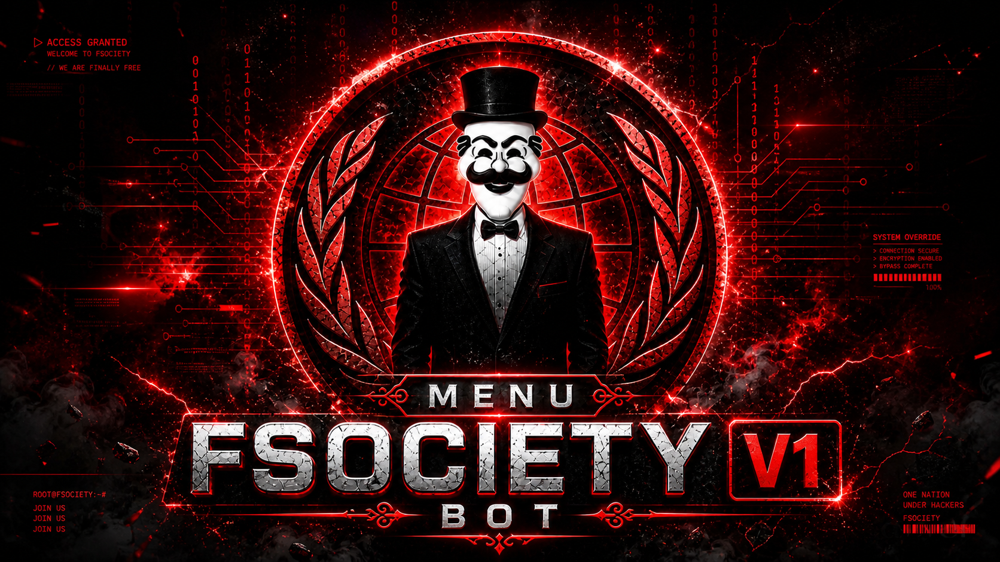

<p align="center">
  <a href="https://www.whatsapp.com/channel/0029VatMd2cGk1FmWw8au11u" target="_blank">
    
  </a>
  <a href="https://chat.whatsapp.com/GuLWXlFUdy3BJA9OXcc1Hj" target="_blank">
    
  </a>
  <a href="https://chat.whatsapp.com/FsrlWXVdG3RCLYbZ5LazBO" target="_blank">
    
  </a>
</p>

<p align="center">
  
</p>

<h1 align="center">Fsociety-V1</h1>

<p align="center">
  
  
  
  
</p>

<p align="center">
Bot de WhatsApp multi-instancia con soporte para <b>bot principal + subbots</b>, util para VPS, Termux y Windows.
</p>

## Tabla de contenido

- [Caracteristicas](#caracteristicas)
- [Requisitos](#requisitos)
- [Instalacion rapida](#instalacion-rapida-linuxvps)
- [Instalacion en Termux](#instalacion-en-termux-android)
- [Instalacion en Linux (Ubuntu/Debian)](#instalacion-en-linux-ubuntudebian)
- [Instalacion en Windows](#instalacion-en-windows)
- [Ejecucion con PM2](#ejecucion-con-pm2-vps-recomendado)
- [Configuracion principal](#configuracion-principal)
- [Canal directo desde el bot](#canal-directo-desde-el-bot)
- [Scripts disponibles](#scripts-disponibles)
- [Recomendaciones](#recomendaciones)
- [Troubleshooting](#troubleshooting)

## Caracteristicas

- Multi-bot por slots (`main` + subbots).
- Pairing por codigo para vincular rapido.
- Modulos de comandos: admin, grupos, juegos, descargas, economia, sistema.
- Integracion de canal/newsletter para soporte.
- Persistencia de sesiones para no perder vinculacion.
- Compatible con PM2 para produccion.

## Requisitos

- `Node.js` 18 o superior (ideal: Node 20 LTS)
- `npm`
- `git`
- `ffmpeg`

## Instalacion rapida (Linux/VPS)

```bash
git clone https://github.com/DevYerZx/fsociety-bot.git
cd fsociety-bot
npm install
npm start
```

## Instalacion en Termux (Android)

<p>
  
  <b>Recomendado:</b> Termux de F-Droid.
</p>

```bash
pkg update -y
pkg upgrade -y
pkg install -y git nodejs-lts npm ffmpeg
termux-setup-storage

git clone https://github.com/DevYerZx/fsociety-bot.git
cd fsociety-bot
npm install
npm start

SI FALLA NPM START 

node.index.js
```

Si falla `npm install` por red:

```bash
npm install --fetch-retries=5
```

## Instalacion en Linux (Ubuntu/Debian)

<p>
  
  <b>Servidor o VPS</b>
</p>

```bash
sudo apt update
sudo apt install -y git ffmpeg curl
curl -fsSL https://deb.nodesource.com/setup_20.x | sudo -E bash -
sudo apt install -y nodejs

git clone https://github.com/DevYerZx/fsociety-bot.git
cd fsociety-bot
npm install
npm start
```

## Instalacion en Windows

<p>
  
  <b>PowerShell</b>
</p>

1. Instala `Node.js LTS`, `Git`, `FFmpeg` (agregado al `PATH`).
2. Ejecuta:

```powershell
git clone https://github.com/DevYerZx/fsociety-bot.git
cd fsociety-bot
npm install
npm start
```

## Ejecucion con PM2 (VPS recomendado)

<p>
  
  <b>Produccion estable</b>
</p>

```bash
npm install -g pm2
npm run pm2:start
pm2 save
pm2 logs
```

## Configuracion principal

Archivo: `settings/settings.json`

- `botName`: nombre del bot.
- `ownerNumber` / `ownerNumbers`: dueños.
- `prefix`: prefijos de comandos.
- `subbots`: slots y estado de subbots.
- `newsletter.enabled`: activa funciones de canal.
- `newsletter.jid`: JID del canal.
- `newsletter.name`: nombre del canal.
- `newsletter.url`: URL directa del canal (boton de soporte).

Ejemplo:

```json
{
  "newsletter": {
    "enabled": true,
    "jid": "120363354701957370@newsletter",
    "name": "Fsociety-V1",
    "url": "https://www.whatsapp.com/channel/0029VatMd2cGk1FmWw8au11u"
  }
}
```

## Canal directo desde el bot

Usa este comando:

```text
.gruposoficiales
```

Si `newsletter.url` esta configurado, el bot envia boton directo para abrir el canal.

## Scripts disponibles

```bash
npm start
npm run check
npm run smoke
npm run pm2:start
npm run pm2:restart
```

## Recomendaciones

- Ejecuta `npm run smoke` despues de cada cambio grande.
- No elimines `dvyer-session/` ni `dvyer-session-subbot*/`.
- Haz backup de `settings/` y `database/`.
- Usa PM2 en VPS para reinicio automatico.
- Mantente en Node LTS para evitar incompatibilidades.

## Troubleshooting

- Bot no responde: `npm run smoke`.
- Error de sintaxis: `npm run check`.
- Canal no abre: revisa `settings.newsletter.url`.
- Sesion perdida: valida carpetas de sesion.

## Dueno y colaborador

<p align="center">
  <a href="https://github.com/DevYerZx" target="_blank">
    
  </a>
  <a href="https://github.com/crxsmods" target="_blank">
    
  </a>
</p>

<p align="center">
  <b>Dueno:</b> <a href="https://github.com/DevYerZx">DevYerZx</a><br/>
  <b>Colaborador:</b> <a href="https://github.com/crxsmods">crxsmods</a>
</p>

## Nota

Este proyecto usa Baileys (no API oficial de WhatsApp Business). Algunos cambios de WhatsApp pueden afectar funciones sin previo aviso.
